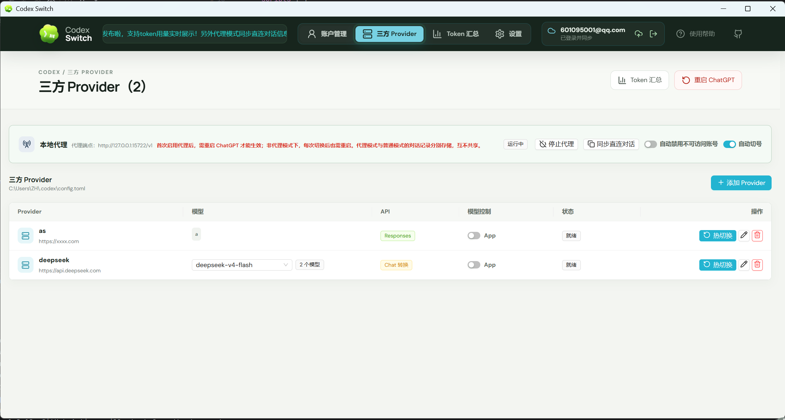
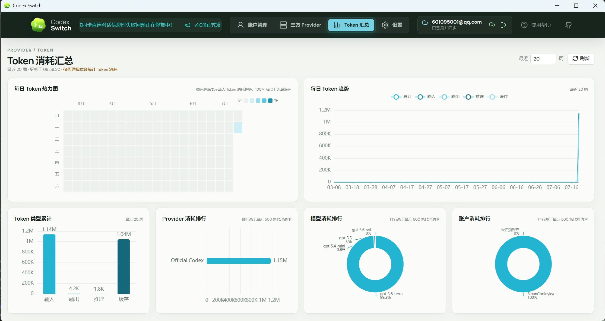
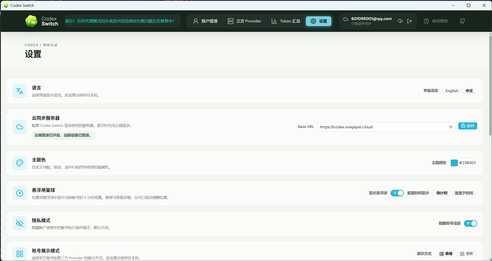

# Codex Switch

> For English documentation, please see [README_EN.md](README_EN.md).

Codex Switch 是一款以本地优先为原则的 Tauri 2 桌面应用，用于登录、保存和切换多个 Codex / ChatGPT 账号。它还支持管理第三方模型服务商、可选的本地热切换代理，以及与自建后端同步以供管理后台和只读移动端使用。

[](LICENSE) [](https://github.com/piperhex/codex-switch/releases)

QQ 技术交流群：`1051213898`。

## 产品截图

### 账号管理与本地代理


### 第三方模型服务商



### Token 消耗汇总



### 设置



### 悬浮用量球


### Dream Skin 换肤


## 功能

- 复用 Codex CLI 的 OAuth 2.0 + PKCE 登录流程。
- 支持应用内登录窗口和系统浏览器登录。
- 支持导入和管理多个 `auth.json`，包括常见第三方 JSON 导出及多账号 JSON 文件。
- 原子化切换 `$CODEX_HOME/auth.json`（默认是 `~/.codex/auth.json`）。
- 通过 `.cs` 备份包导出和恢复本地账号与服务商配置。
- 展示账号邮箱、套餐、主/次用量窗口和重置卡，并可使用可用重置卡。
- 支持手动或定时刷新单个账号及全部账号。
- 可从控制台和托盘执行尽力而为的“重启 ChatGPT”操作。
- 支持系统托盘快捷切号，以及可选的置顶悬浮用量球。
- 支持 OpenAI Responses、兼容 Chat Completions 的第三方服务商、多模型，以及直接切换配置或通过本地代理热切换。
- 记录经本地代理转发请求的 Token 用量，并可导出结构化代理诊断信息。
- 在官方账号模式下，可在额度耗尽后刷新账号、选择主用量窗口使用率最低的可用账号、切换凭据并重试一次请求。
- 支持界面语言、主题色、隐私模式和悬浮球偏好的本地设置。
- 可选同步到自建 NestJS 后端；Expo 移动端只读取已脱敏的账号与用量摘要。
- 账号和服务商密钥仅保存在 Rust 后端，不会暴露给桌面端 React 界面或应用日志。

> [!IMPORTANT]
> 本地账号凭据、服务商 API 密钥和桌面端云登录令牌保存在应用数据目录中，未额外进行静态加密。`.cs` 备份包含有可恢复的账号凭据和服务商密钥，必须像 `auth.json` 一样妥善保护。云同步为可选功能；启用后，账号凭据和服务商密钥会上传到你配置的服务器。请仅在可信设备与可信自建服务器上使用，切勿提交或分享凭据文件、备份包，并在共享诊断导出文件前仔细检查内容。

## 技术栈

- 前端：React 18、TypeScript、Vite、Ant Design
- 桌面运行时：Tauri 2
- 后端：Rust、Reqwest、Serde
- 可选云服务：NestJS、TypeORM、PostgreSQL、Redis、JWT 认证
- 移动端：React Native、Expo
- Monorepo：npm workspaces、Lerna、Nx

## 快速开始

### 前置要求

- Node.js 18 或更高版本
- npm
- 最新稳定版 Rust 工具链
- 对应平台的 [Tauri 2 系统依赖](https://v2.tauri.app/start/prerequisites/)
- Windows 上的 WebView2（大多数现代 Windows 已预装）
- macOS 上的 Xcode Command Line Tools

Ubuntu 请先安装 Tauri 的 Linux 构建依赖：

```bash
sudo apt update
sudo apt install libwebkit2gtk-4.1-dev build-essential curl wget file libxdo-dev libssl-dev libappindicator3-dev librsvg2-dev patchelf xdg-utils
```

安装依赖并启动桌面应用：

```powershell
npm install
npm run dev:app
```

使用演示数据启动浏览器预览（不会访问真实凭据）：

```powershell
npm run dev
```

启动管理控制台或云端后端：

```powershell
npm run dev:admin
npm run dev:backend
```

启动 Expo 移动端：

```powershell
npm run start -w @codex-switch/native
```

移动端需要已部署的云端后端，并且仅显示已同步的账号摘要。详细配置请参阅 [移动端文档](apps/native/README.md) 和 [管理后端文档](apps/admin/README.md)。

构建桌面安装包：

```powershell
npm run build:app
```

在 macOS 上构建同时支持 Apple Silicon 和 Intel 的通用包：

```bash
npm run build:app:mac
```

在 Windows 上构建 ARM64 安装包：

```powershell
rustup target add aarch64-pc-windows-msvc
npm run build:app:win-arm64
```

Windows ARM64 构建还需要在开发环境中安装带 ARM64 构建工具的 MSVC C++ 工具链。Ubuntu 上运行 `npm run build:app` 会生成 `.deb` 和 AppImage 安装包。

运行全部前后端检查：

```powershell
npm run check
```

## 使用说明

1. 选择“添加账户”，然后在应用内登录、使用系统浏览器登录、导入现有 `auth.json` 或导入兼容 JSON 导出。兼容导入支持单个对象、数组、`{ "accounts": [...] }` 包装对象和逐行 JSON，并识别常见的令牌与会话字段名。
2. 在账号列表刷新用量；展开行可查看重置卡。
3. 选择“切换”，即可原子化替换 Codex 当前使用的 `auth.json`。
4. 若运行中的 ChatGPT/Codex 进程可能仍缓存旧凭据，请在控制台或托盘选择“重启 ChatGPT”。

使用账号工具栏的“导入”和“导出”可恢复或创建包含所有本地账号与服务商配置的 `.cs` 备份。导入会按稳定标识合并记录，并不会将备份当成可随意公开的无密钥导出文件。

“第三方服务商”页面用于管理兼容 OpenAI Responses 或 Chat Completions 的接口、API 密钥、模型列表，以及由 Codex 还是 Codex Switch 控制模型选择。未启用本地代理时，切换会写入 `$CODEX_HOME/config.toml` 的受管区段，正在运行的会话可能需要重启。启动代理后，应用会监听 `127.0.0.1:15722` 并使 Codex 指向该地址，从而支持热切换。

官方账号模式下，“自动切号”会在收到额度响应后刷新已保存账号，选择主用量窗口使用率最低的符合条件账号，切换凭据后重试该请求一次。“Token 汇总”窗口展示该代理观察到的请求用量。

设置页可配置界面语言、主题色、隐私模式、悬浮用量球、全部账号的全局自动刷新、当前账号的独立刷新、云端后端地址、本地数据目录快捷入口，以及代理诊断导出。

系统托盘菜单可以显示控制台、切换账号、重启 ChatGPT 或退出。悬浮用量球展示当前账号的主用量窗口：左键会刷新该账号，悬停可展开，支持拖动位置，并在右键菜单中提供相同的快捷操作。

应用会优先使用 `CODEX_HOME` 环境变量，否则使用 `~/.codex`。受管账号副本、服务商配置、应用设置、云令牌、代理日志和 Token 用量历史均保存在操作系统的应用数据目录中。

在设置页填写 Base URL 前，云端登录保持关闭。登录后，手动同步和正常的账号/服务商变更会与该服务器交换完整凭据载荷；移动端调用的是经过脱敏的 `/sync/accounts/summary` 路由，永远不会收到 `auth.json` 内容。

## 项目结构

```text
apps/desktop/        Tauri 桌面应用工作区
  src/               React 前端
  api/               Tauri 命令和浏览器预览适配层
  components/        可复用展示组件
  hooks/             账号、通知和自动刷新状态
  pages/             页面级组合
  utils/             无副作用的格式化工具
  src-tauri/src/     Rust 后端
apps/admin-ui/       React 管理控制台工作区
apps/admin/          NestJS 云端后端工作区
apps/native/         Expo 移动端账号用量伴侣应用
docs/                架构和开发文档
```

更多文档：

- [架构与数据流](docs/architecture.md)
- [开发与调试](docs/development.md)
- [贡献指南](CONTRIBUTING.md)

## 发布版本

推送版本标签后，GitHub Actions 会自动发布构建产物：

```bash
npm run release
npm run release-beta
```

`npm run release` 会读取 `package.json`，将补丁版本加 1，同步更新版本文件、创建提交和带注释标签，然后推送分支与标签。`npm run release-beta` 会创建或递增类似 `v0.1.1-beta.0` 的预发布标签。可通过 `npm run release -- v0.2.0` 或 `npm run release-beta -- v0.2.0-beta.1` 指定准确版本。

发布工作流构建 Windows x64、Windows ARM64、Ubuntu/Linux x64、macOS Apple Silicon 与 Intel、Android APK 以及未签名的 iOS Release `.app.zip`，并上传到对应 GitHub Release。iOS 产物用于验证构建，安装到设备或提交 App Store 前仍需要 Apple 签名凭据。

## 参与贡献

欢迎提交 Issue 和 Pull Request。开始前请阅读 [贡献指南](CONTRIBUTING.md)，尤其是关于凭据脱敏、职责边界和本地验证的要求。

## 许可证

Codex Switch 使用 [Apache License 2.0](LICENSE)，与官方 [OpenAI Codex](https://github.com/openai/codex) 仓库一致。

## 当前限制

- OAuth 回调会优先使用本地端口 `1455`，失败后回退到 `1457`。
- 完整账号管理与第三方服务商工作流仅支持桌面端；移动端仅用于查看同步到云端的数据。
- macOS 发布构建采用临时签名；除非在 CI 配置 Apple Developer 签名与公证凭据，否则不会完成公证。
- 已发布的 iOS `.app.zip` 未签名，仅为 CI 构建产物，不能直接作为 App Store 安装包使用。
- 内嵌登录依赖 WebView 与身份提供商策略；若失败，请使用系统浏览器登录。
- 本地代理仅监听 `127.0.0.1:15722`；Token 历史仅包含经该代理转发的请求。
- “重启 ChatGPT”为尽力而为的操作，依赖本地进程发现以及操作系统重新启动 ChatGPT 或旧版 `codex` 入口的能力。
