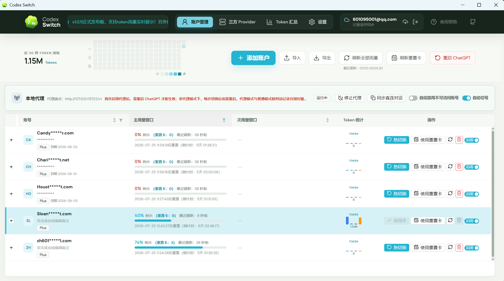

# Codex Switch

Codex Switch is a local-first Tauri 2 desktop application for signing in to, storing, and switching between multiple Codex / ChatGPT accounts. It also displays the usage windows for each account.

[](LICENSE) [](https://github.com/piperhex/codex-switch/releases)



## Features

- Reuses the Codex CLI OAuth 2.0 + PKCE login flow
- Supports both an in-app login window and the system browser
- Imports and manages multiple `auth.json` files
- Atomically switches `$CODEX_HOME/auth.json` (defaults to `~/.codex/auth.json`)
- Displays account email, plan, 5-hour / weekly usage, and reset credits
- Refreshes one or all accounts manually or on a timer
- Keeps tokens in the Rust backend and out of the React UI and application logs

> [!IMPORTANT]
> Credentials are stored in the local application data directory, but the application does not add another layer of encryption. Use a trusted device and protect your operating-system account. Never commit, share, or include an `auth.json` file in a screenshot.

## Technology

- Frontend: React 18, TypeScript, Vite, and Ant Design
- Desktop runtime: Tauri 2
- Backend: Rust, Reqwest, and Serde

## Getting Started

### Prerequisites

- Node.js 18 or later
- npm
- The latest stable Rust toolchain
- The appropriate [Tauri 2 system dependencies](https://v2.tauri.app/start/prerequisites/) for your platform
- WebView2 on Windows (already installed on most modern Windows systems)
- Xcode Command Line Tools on macOS

Install dependencies and start the desktop application:

```powershell
npm install
npm run dev:app
```

Start the browser-only preview with demo data and no access to real credentials:

```powershell
npm run dev
```

Build the desktop installer:

```powershell
npm run build:app
```

On macOS, build a universal Apple Silicon + Intel bundle:

```bash
npm run build:app:mac
```

Run all frontend and backend checks:

```powershell
npm run check
```

## Releases

GitHub Actions publishes release assets automatically when a version tag is pushed:

```bash
npm run release
npm run release-beta
```

`npm run release` reads `package.json`, bumps the patch version by 1, updates `package.json`, `package-lock.json`, and `src-tauri/tauri.conf.json`, commits the version bump, creates an annotated tag such as `v0.1.1`, then pushes both the branch and tag to `origin`. `npm run release-beta` creates a prerelease tag such as `v0.1.1-beta.0`, or increments the beta number if the current version is already beta, and also pushes automatically.

You can pass an exact version or tag with `npm run release -- v0.2.0` or `npm run release-beta -- v0.2.0-beta.1`. Explicit versions are also synced into the version files before the tag is created.

The release workflow builds Windows x64 plus macOS Apple Silicon and Intel artifacts, then uploads them to the matching GitHub Release. Release notes are generated automatically from the commits and pull requests included in the tag diff, with the installer download note kept at the top. Tags containing a prerelease suffix, such as `-beta.0`, are published as GitHub prereleases. The workflow can also be run manually from Actions by entering an existing tag.

## Usage

1. Select **Add account**, then sign in through the app, use the system browser, or import an existing `auth.json` file.
2. Refresh usage from the account list. Expand a row to view its reset credits.
3. Select **Switch** to atomically replace the `auth.json` file currently used by Codex.
4. Restart the relevant Codex session after switching so that a running process does not continue using cached credentials.

The Settings page provides both a global auto-refresh timer for all saved accounts and an independent timer for the current account. Current-account timer settings are saved separately for each account.

The application honors the `CODEX_HOME` environment variable and falls back to `~/.codex` when it is not set. Managed account copies are stored under `codex-switch/accounts` in the operating system's application data directory.

## Project Structure

```text
src/                 React frontend
  api/               Tauri command and browser-preview adapter
  components/        Reusable presentation components
  hooks/             Account, notification, and auto-refresh state
  pages/             Page-level composition
  utils/             Side-effect-free formatting helpers
src-tauri/src/       Rust backend
  auth.rs            Credential validation and account identity parsing
  codex_api.rs       Token refresh and Codex HTTP API access
  commands.rs        Tauri command boundary and use-case orchestration
  oauth.rs           OAuth PKCE login flow
  storage.rs         Paths, atomic writes, and the account store
  models.rs          Frontend/backend transfer models
docs/                Architecture and development documentation
```

More documentation:

- [Architecture and data flow](docs/architecture.md)
- [Development and debugging](docs/development.md)
- [Contributing guide](CONTRIBUTING.md)

## Contributing

Issues and pull requests are welcome. Read [CONTRIBUTING.md](CONTRIBUTING.md) before getting started, especially the credential-redaction, responsibility-boundary, and local-validation requirements.

## License

Codex Switch is licensed under the [Apache License 2.0](LICENSE), the same license used by the official [OpenAI Codex](https://github.com/openai/codex) repository.

## Current Limitations

- The OAuth callback first attempts to use local port `1455`, then falls back to `1457`.
- The application currently targets desktop environments.
- macOS release builds are ad-hoc signed, but not notarized unless Apple Developer signing/notarization credentials are added to CI.
- Embedded login depends on WebView and identity-provider policies; use the system browser if it fails.
