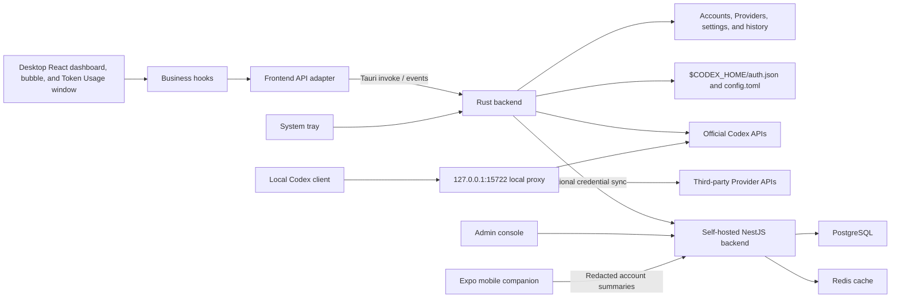

# Architecture and Data Flow

This document describes the responsibility boundaries, key data flows, persistence, and security constraints of Codex Switch.

## Overview



The desktop React frontend receives redacted models such as `AccountSummary`, `ProviderSummary`, `UsageSummary`, `ResetCreditsSummary`, `CloudAuthState`, and `TokenUsageEntry`. Complete account credentials and Provider API keys remain in Rust. They leave the device only when the user exports a `.cs` backup or enables synchronization with a configured backend.

## Desktop Frontend Responsibilities

- `apps/desktop/src/api/backend.ts` is the only entry point for Tauri IPC and file selection. It also provides browser-preview behavior.
- `apps/desktop/src/hooks/useAccountManager.ts` orchestrates loading, login, compatible JSON and `.cs` import/export, switching, deletion, and usage refreshes.
- `apps/desktop/src/hooks/useProviderManager.ts` owns Provider profiles, model selection, local-proxy state, and quota-failover settings.
- `apps/desktop/src/hooks/useCloudAuth.ts` owns optional backend configuration, login, logout, and synchronization.
- `apps/desktop/src/hooks/useResetCredits.ts` owns reset-credit counts and consumption. `useAutoRefresh.ts` owns both refresh timers.
- `useFloatingBubble.ts`, `useThemeColor.ts`, `usePrivacyMode.ts`, `useBubbleResetDisplay.ts`, and `useLanguage.ts` manage UI and window preferences.
- `apps/desktop/src/pages/` composes page layouts and does not call Tauri directly.
- `apps/desktop/src/components/` contains presentation and local interactions. `FloatingUsageBubble.tsx` and `TokenUsageWindow.tsx` render standalone Tauri windows.
- `apps/desktop/src/utils/` contains pure formatting and theme helpers.

## Rust Backend Responsibilities

- `models.rs` defines redacted IPC responses, local state, and cloud synchronization payloads.
- `auth.rs` decodes JWT payloads, validates credentials, and generates stable account IDs.
- `storage.rs` resolves data directories and handles JSON reads, atomic replacement, metadata, and account-store synchronization.
- `codex_api.rs` refreshes tokens, sends authorized requests, and parses usage and reset-credit responses.
- `oauth.rs` owns PKCE parameters, the local callback server, the embedded login window, and credential exchange.
- `commands.rs` exposes account, compatible-import, usage, reset-credit, update, folder, and process-restart commands.
- `account_archive.rs` packages and restores account credentials, metadata, usage, Provider profiles, and active identifiers in `.cs` archives.
- `providers.rs` validates Provider profiles, stores API keys, backs up the original Codex config, and writes managed `config.toml` sections and model catalogs.
- `local_proxy.rs` owns the loopback server, official/Provider routing, Chat Completions-to-Responses bridging, diagnostics, token history, and official-account quota failover.
- `cloud.rs` owns optional backend authentication and last-modified-wins synchronization for complete account and Provider payloads.
- `floating_bubble.rs` owns the floating window, persisted app settings, cross-window events, context-menu positioning, and bubble-position persistence.
- `system_tray.rs` owns tray menus, dashboard reveal behavior, account quick switching, and the restart action.
- `lib.rs` registers plugins, windows, tray setup, event handlers, and commands and restores the local proxy when it was enabled at shutdown.

## Cloud Backend and Mobile Responsibilities

- `apps/admin` exposes registration/login, refresh-token, account sync, Provider sync, redacted mobile-summary, and admin-management routes.
- PostgreSQL stores users, dynamic RBAC roles, built-in and custom permission definitions, role-permission assignments, refresh tokens, synchronized account credentials, Provider API keys, admin audit data, feedback with image attachments, and the optional official-account pool. Redis caches account and Provider lists.
- The admin console at `/admin` manages roles and permissions (including custom permission definitions for external systems), users, their synchronized accounts and Providers, invitations, approval requests, feedback and replies, audit logs, and official-account assignments.
- An official account assigned to a user is merged into that user's effective sync list. The assigned system copy wins when its stable account ID collides with a personal copy, and it must be edited or removed from the official pool.
- `apps/native` stores only its cloud login session in the platform secure store and reads `/sync/accounts/summary`. The response excludes each account's `auth` payload; the mobile app cannot switch accounts or refresh official usage directly.

## Key Data Flows

### Login and Import

1. For OAuth login, Rust creates a PKCE verifier, challenge, and random state, starts a local callback listener, exchanges the returned code, and validates the state.
2. A normal `auth.json` import validates the selected file directly. Compatible import accepts a JSON object, an array, an `{ "accounts": [...] }` wrapper, or newline-delimited objects and extracts common token, credential, auth, or session fields.
3. If compatible input contains only a refresh token, Rust attempts an official token refresh before validation.
4. Rust derives the stable account ID, writes a canonical `auth.json` to the managed store, emits `accounts-changed`, and optionally pushes the account when cloud sync is authenticated.

### Backup Import and Export

1. Export synchronizes the active `auth.json` into the managed store and collects account credentials, notes, expiry metadata, usage, Provider profiles, and active IDs.
2. The payload is compressed and placed in a `.cs` container. The format keeps secrets out of casual plaintext inspection but does not use a user-supplied or device-specific key, so the file must still be handled as a credential backup.
3. Import validates every account and Provider before merging them by stable identifier and restoring active state where possible.

### Account Switching and Usage

1. Before a switch, the backend makes a best-effort copy of the current `$CODEX_HOME/auth.json` to preserve tokens Codex may have refreshed.
2. It revalidates the selected managed account and atomically replaces `$CODEX_HOME/auth.json`.
3. It updates `state.json`; if the local proxy is running, it reapplies the proxy config so the new official credential is used without changing Codex's endpoint.
4. Usage refresh treats the active `$CODEX_HOME/auth.json` as authoritative, refreshes tokens before expiry or after a `401`, and saves only the parsed windows to `usage.json`.

### Provider Switching and Local Proxy

1. A Provider profile contains a name, upstream Base URL, API key, active model, model list, API format, and model-selection owner. IPC returns only `hasApiKey`, never the key.
2. Direct switching backs up the original Codex config once and writes managed root/provider sections. Chat Completions Providers require the local proxy because Codex speaks the Responses protocol.
3. Starting the proxy binds `127.0.0.1:15722`, writes a local Provider entry to `config.toml`, and persists the enabled state. Subsequent official-account, Provider, and model switches update the proxy target without requiring a Codex restart.
4. The proxy records redacted diagnostics and extracts token counts from completed Responses streams into SQLite and JSONL history. The Token Usage window displays the newest 500 rows; the database retains up to 10,000.
5. When quota failover is enabled in official-account mode, a quota-like `429` or `403` triggers a fresh usage query for every saved account. The proxy excludes failed, exhausted, and current accounts, switches to the account with the lowest primary-window used percentage, and retries the original request once.

### Cloud Synchronization

1. Cloud login is disabled until a backend Base URL is saved in Settings. Desktop access and refresh tokens are stored locally in `cloud-auth.json`.
2. After authentication, account and Provider changes push complete payloads to the configured server. Manual sync downloads remote changes and then uploads local entries; `lastModifiedAt` resolves competing edits.
3. Full `/sync/accounts` responses are for desktop synchronization. `/sync/accounts/summary` removes `auth` before serving the mobile app.
4. Cloud logout removes the local cloud session but does not delete synchronized server data or local account data.

### Issue Feedback

1. The Help dialog opens a feedback form that includes the app version and platform user agent. Signed-in submissions use the existing cloud JWT so the backend binds the verified account email; anonymous submissions contain no contact email.
2. A submission accepts up to four JPEG, PNG, or WebP images. The desktop UI compresses any image larger than 5 MB before IPC, and both Rust and NestJS enforce the 5 MB per-image limit again.
3. Feedback image bytes remain in PostgreSQL and are only returned through permission-guarded admin endpoints. The admin console can preview attachments and send a plain-text SMTP reply when a verified email is available.

### Settings, Tray, and Auxiliary Windows

1. App settings such as the floating bubble, theme, privacy mode, reset-time display, bubble position, and cloud profile are stored in `settings.json`.
2. Language and the two auto-refresh timers are UI-only WebView preferences. Cross-window events keep language, theme, and bubble display synchronized.
3. The tray and floating-bubble context menus are rebuilt after account, usage, or Provider changes.
4. Auxiliary Tauri windows use dedicated labels (`usage-bubble`, `token-usage`, and `login`) and must be listed in the default capability file.

### Restart ChatGPT

1. The dashboard, tray, or bubble calls `restart_chatgpt` when a config or credential switch is not picked up by a running session.
2. On Windows, the backend prefers the StartApps/AppX ChatGPT entry, falls back to discovered `ChatGPT.exe` paths, stops ChatGPT and legacy `codex` processes, and relaunches ChatGPT.
3. macOS and Linux use the available platform process and launch strategy. Restart is best effort and does not read or log credentials.

## Persisted Data Layout

```text
OS application data/
  state.json
  settings.json
  cloud-auth.json
  config-before-provider.toml
  token-usage.sqlite3
  accounts/
    <stable account ID>/
      auth.json
      usage.json
      note.txt
      expires-at.txt
      last-modified-at.txt
  providers/
    <provider ID>.json
  logs/
    local-proxy-diagnostics.jsonl
    token-usage.jsonl

$CODEX_HOME/
  auth.json
  config.toml
  codex-switch-model-catalog.json
```

Some files are created only after the corresponding feature is used. The stable account ID is a truncated hash of the user identity and ChatGPT account ID and does not contain token data.

The WebView `localStorage` contains UI-only preferences such as language, last all-account refresh time, and global/current-account auto-refresh state.

## Security Boundary

- The desktop React UI never receives complete account credentials or Provider API keys. Provider summaries expose only whether a key exists.
- Local account, Provider, desktop cloud-session, and diagnostic files are not protected by an additional application-level at-rest encryption layer. Operating-system account and file permissions remain part of the trust boundary.
- `.cs` archives contain restorable secrets. Their built-in container protection is not a substitute for access control or a user-held encryption key.
- Enabling cloud sync deliberately sends complete account credentials and Provider API keys to the configured backend. Use HTTPS and a server whose operators and storage you trust.
- The admin official-account workflow accepts and stores complete `auth.json` objects. Admin access, PostgreSQL backups, logs, and operational tooling must be treated as credential-bearing systems.
- Mobile receives redacted summaries only, but its cloud access and refresh tokens are still sensitive and are stored through Expo SecureStore.
- Proxy diagnostics summarize request shapes and selected response details; authorization headers, prompt text, and full successful response bodies must not be logged.
- `auth.json`, `.cs` backups, exported diagnostics, and production database dumps must never be committed. Diagnostics can contain upstream error details even though request content and credential headers are summarized or omitted. Test fixtures must use unusable fake values.
- Atomic writes reduce corruption risk but do not provide confidentiality. OAuth state and PKCE reduce forged-callback and intercepted-code risk.
