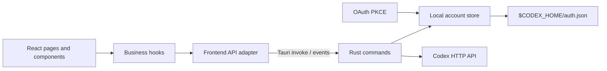

# Architecture and Data Flow

This document describes the responsibility boundaries, key data flows, and security constraints of Codex Switch.

## Overview



The frontend only receives redacted models such as `AccountSummary`, `UsageSummary`, and `AppInfo`. Complete `auth.json` contents, access tokens, and refresh tokens remain in the Rust backend.

## Frontend Responsibilities

- `src/api/backend.ts` is the only entry point for Tauri IPC and file selection. It also provides browser-preview behavior.
- `src/hooks/useAccountManager.ts` orchestrates loading, login, import, switching, deletion, and usage refreshes.
- `src/hooks/useAutoRefresh.ts` persists the global refresh timer plus per-account timers and owns their lifecycles.
- `src/pages/` composes page-level layouts and does not call the backend directly.
- `src/components/` contains presentation and local interactions. The account table loads reset credits through the API adapter.
- `src/utils/` contains pure formatting helpers for dates, quotas, and display text.

## Backend Responsibilities

- `models.rs` defines IPC responses and persisted summary structures.
- `auth.rs` decodes JWT payloads, validates credentials, and generates stable account IDs.
- `storage.rs` resolves data directories and handles JSON reads, atomic replacement, and account-store synchronization.
- `codex_api.rs` refreshes tokens, sends authorized requests, and parses usage and reset-credit responses.
- `oauth.rs` owns PKCE parameters, the local callback server, the login window, and credential exchange.
- `commands.rs` exposes commands to the frontend and only orchestrates use cases and events.
- `lib.rs` registers plugins, application state, and commands. It contains no business rules.

## Key Data Flows

### Login

1. The frontend calls `start_login` and never receives OAuth tokens.
2. Rust creates a PKCE verifier, challenge, and random state, then starts a local callback listener.
3. After authorization, Rust validates the state and exchanges the authorization code for tokens.
4. Rust validates the credentials, derives an account ID, and writes the complete `auth.json` to the account store.
5. The backend emits `login-status` and `accounts-changed`; the frontend reloads redacted summaries.

### Account Switching

1. The backend makes a best-effort copy of the current `auth.json` to preserve tokens that Codex may have refreshed.
2. It reads and validates the selected account again.
3. It updates `$CODEX_HOME/auth.json` using a temporary file and an atomic replacement in the same directory.
4. It updates the active account ID in `state.json` and tells the frontend to reload.

### Usage Refresh

1. For the account currently used by Codex, the backend reads `$CODEX_HOME/auth.json` as the authoritative credential source and syncs it into the managed store when it differs. Other accounts use their managed-store credentials.
2. It refreshes the token before expiry or after a `401` response, then writes updated active credentials back to both `$CODEX_HOME/auth.json` and the managed store.
3. It calls the Codex usage API and parses only the fields required by the UI.
4. It writes the resulting summary to `usage.json`; the complete API response is never sent to the frontend.

## Persisted Data Layout

```text
OS application data/codex-switch/
  state.json
  accounts/
    <stable account ID>/
      auth.json
      usage.json

$CODEX_HOME/
  auth.json
```

The stable account ID is a truncated hash of the user identity and ChatGPT account ID. It does not contain token data.

## Security Boundary

- React never receives or renders tokens.
- Errors and events must not include complete requests, responses, authorization codes, or credentials.
- `auth.json` is ignored by Git; test fixtures must use fake tokens.
- Atomic writes reduce the risk of file corruption after interruption, but they do not provide encryption.
- OAuth state and PKCE reduce the risk of forged callbacks and intercepted authorization codes.
